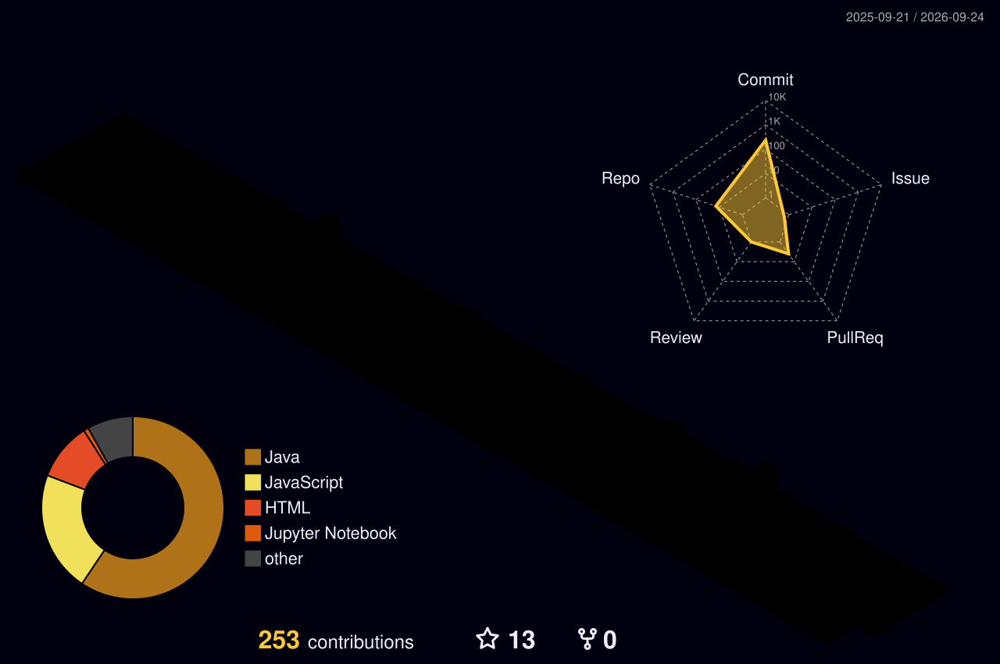

  

## Nakshatra Jain

I write backend code, break it, stare at logs for a while, and eventually figure out what went wrong.

I'm currently in my final year of Computer Science at **VIT Bhopal**. Most of what I build sits somewhere around **Spring Boot, databases, distributed systems, cloud infrastructure, and APIs**. Lately, I've been playing around with **Kafka, RAG, and Kubernetes** too.

I don't really enjoy building projects just to say I built them. I prefer taking an idea, putting an actual system behind it, deploying it somewhere, and seeing what happens when real requests start hitting it.

Some things I've been working with lately:

`Java` · `Spring Boot` · `PostgreSQL` · `Redis` · `Kafka` · `AWS` · `Docker` · `React` · `Next.js` · `Qdrant`

And somewhere between all of that, I occasionally convince myself that turning a normal dashboard into a **3D skyline** is a good use of time.

**Currently building things, learning distributed systems, and trying not to blame the database first.**

 

<!-- ================= SOCIAL LINKS ================= -->

 

<!-- ================= 3D SKYLINE ================= -->
### 🌌 3D Contribution Skyline

  

 

<!-- ================= LANGUAGES & TOOLS ================= -->
<!-- Languages & Tools — all icons verified/fixed. Broken devicon links replaced with shields.io badges (self-rendering, no dead-CDN risk). -->

<h2 align="center">Languages &amp; Tools</h2>

  <!-- Languages -->

  <table>
    <thead>
      <tr>
        <th colspan="7">Languages</th>
      </tr>
    </thead>
    <tr>
      <td align="center" width="110">
        
      </td>
      <td align="center" width="110">
        
      </td>
      <td align="center" width="110">
        
      </td>
      <td align="center" width="110">
        
      </td>
    </tr>
    <tr>
      <td align="center">Java</td>
      <td align="center">Python</td>
      <td align="center">SQL</td>
      <td align="center">JavaScript</td>
    </tr>
  </table>

  <!-- Backend -->

  <table>
    <thead>
      <tr>
        <th colspan="7">Backend</th>
      </tr>
    </thead>
    <tr>
      <td align="center" width="110">
        
      </td>
      <td align="center" width="110">
        
      </td>
      <td align="center" width="110">
        
      </td>
      <td align="center" width="110">
        
      </td>
    </tr>
    <tr>
      <td align="center">Spring Boot</td>
      <td align="center">Hibernate/JPA</td>
      <td align="center">Swagger/OpenAPI</td>
      <td align="center">WebSockets</td>
    </tr>
  </table>

  <!-- Cloud & DevOps -->

  <table>
    <thead>
      <tr>
        <th colspan="7">Cloud &amp; DevOps</th>
      </tr>
    </thead>
    <tr>
      <td align="center" width="110">
        
      </td>
      <td align="center" width="110">
        
      </td>
      <td align="center" width="110">
        
      </td>
      <td align="center" width="110">
        
      </td>
    </tr>
    <tr>
      <td align="center">AWS</td>
      <td align="center">Docker</td>
      <td align="center">GitHub</td>
      <td align="center">GitHub Actions</td>
    </tr>
    <tr>
      <td align="center">
        
      </td>
      <td align="center">
        
      </td>
      <td align="center">
        
      </td>
      <td align="center">
        
      </td>
    </tr>
  </table>

  <!-- Databases & Messaging -->

  <table>
    <thead>
      <tr>
        <th colspan="7">Databases &amp; Messaging</th>
      </tr>
    </thead>
    <tr>
      <td align="center" width="110">
        
      </td>
      <td align="center" width="110">
        
      </td>
      <td align="center" width="110">
        
      </td>
    </tr>
    <tr>
      <td align="center">PostgreSQL</td>
      <td align="center">Redis</td>
      <td align="center">Apache Kafka</td>
    </tr>
  </table>

  <!-- Frontend -->

  <table>
    <thead>
      <tr>
        <th colspan="7">Frontend</th>
      </tr>
    </thead>
    <tr>
      <td align="center" width="110">
        
      </td>
      <td align="center" width="110">
        
      </td>
      <td align="center" width="110">
        
      </td>
      <td align="center" width="110">
        
      </td>
    </tr>
    <tr>
      <td align="center">React.js</td>
      <td align="center">Next.js</td>
      <td align="center">Firebase Auth</td>
      <td align="center">Tailwind CSS</td>
    </tr>
  </table>

  <!-- Testing & Monitoring -->

  <table>
    <thead>
      <tr>
        <th colspan="7">Testing &amp; Monitoring</th>
      </tr>
    </thead>
    <tr>
      <td align="center" width="110">
        
      </td>
      <td align="center" width="110">
        
      </td>
      <td align="center" width="110">
        
      </td>
      <td align="center" width="110">
        
      </td>
    </tr>
    <tr>
      <td align="center">JUnit 5</td>
      <td align="center">Prometheus</td>
      <td align="center">Grafana</td>
      <td align="center">k6</td>
    </tr>
  </table>

  <!-- AI & Search -->

  <table>
    <thead>
      <tr>
        <th colspan="7">AI &amp; Search</th>
      </tr>
    </thead>
    <tr>
      <td align="center" width="110">
        
      </td>
      <td align="center" width="110">
        
      </td>
      <td align="center" width="110">
        
      </td>
    </tr>
    <tr>
      <td align="center">Qdrant</td>
      <td align="center">OpenAI API</td>
      <td align="center">RAG Architecture</td>
    </tr>
  </table>

 

<!-- ================= GITHUB STATS ================= -->
<h2 align="center"> Gɪᴛʜᴜʙ Sᴛᴀᴛs </h2>
<table width="100%">
  <tr>
    <td width="50%" align="center" valign="middle">
      <h3 align="center"><strong>Sᴛʀᴇᴀᴋ Sᴛᴀᴛs</strong></h3>
      

        
      

    </td>
    <td width="50%" align="center" valign="middle">
      <h3 align="center"><strong>Gɪᴛʜᴜʙ Sᴛᴀᴛs</strong></h3>
      

        
      

    </td>
  </tr>
</table>

 

<!-- ================= CONTRIBUTION SNAKE ================= -->
<h2 align="center">🐍 Contribution Snake</h2>

  

 

<!-- ================= VISITOR COUNTER ================= -->

  

