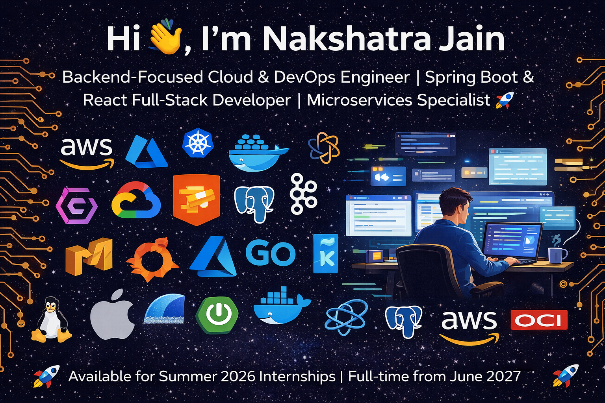

<h1 align="center">Hi 👋, I'm Nakshatra Jain</h1>
<h3 align="center">Backend-Focused Cloud & DevOps Engineer | Spring Boot & React Full-Stack Developer | Microservices Specialist 🚀</h3>

  

- 🌱 **Currently learning & mastering**: Advanced Spring Boot Microservices, AWS/GCP/OCI Architectures, Kubernetes Orchestration, ML Integration in Web Apps
- 💬 **Ask me about**: Spring Boot REST APIs, Docker CI/CD Pipelines, PostgreSQL Optimization, Full-Stack Deployment, Cloud Certifications
- 📫 **Reach me**: nakshtrajain25@gmail.com | 📱 +91-8010726861
- ⚡ **Fun fact**: Debugging is like solving a detective mystery but with semicolons 😆

<h3 align="left">Connect with me:</h3>

<h3 align="left">Languages and Tools:</h3>

 
 
 
 
 
 
 
 
 
 
 
 
 
 
 
 

&nbsp;

  <h3>🚀 Available for Summer 2026 Internships | Full-time from June 2027 🚀</h3>

